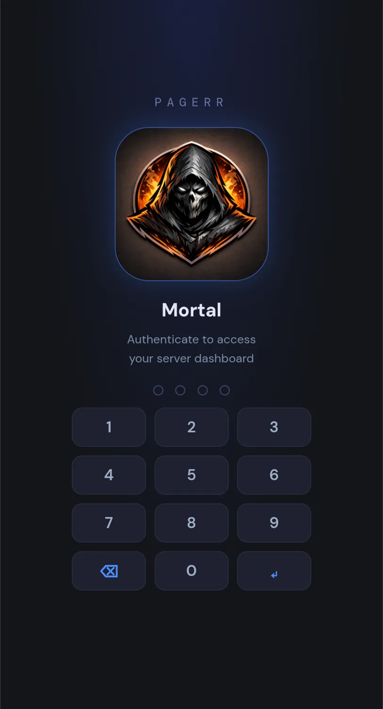
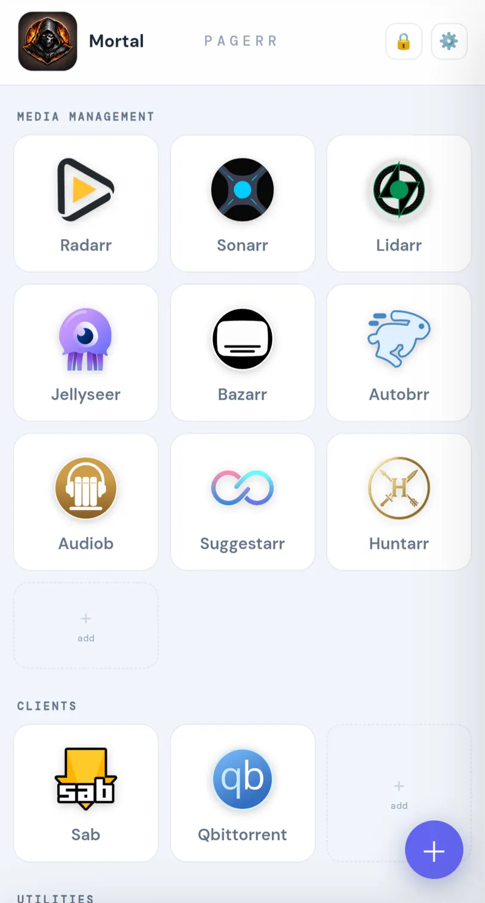
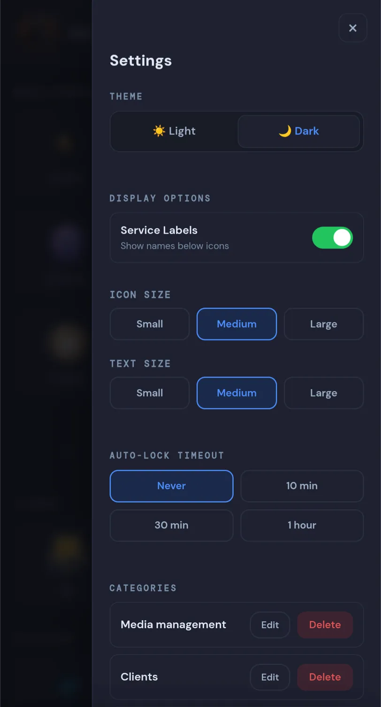

<div align="center">


# Pagerr

**A PIN-protected, single-file homelab dashboard.**


Pagerr is a single HTML file that gives you a clean, mobile-first dashboard for all your self-hosted services. No database. No backend. No accounts. Everything lives in your browser's `localStorage`.

Built for Tailscale. Works behind any reverse proxy.

</div>

---

## Screenshots

| Lock Screen | Dashboard (Dark) | Dashboard (Light) | Settings |
|:-----------:|:----------------:|:-----------------:|:--------:|
|  |  |  |  |

---

## Features

- **Single file** — the entire app is one `.html` file. Serve it anywhere
- **PIN lock** — 4–6 digit PIN set on first launch, with optional biometric unlock
- **Auto icon matching** — fetches service icons automatically from [dashboard-icons](https://github.com/homarr-labs/dashboard-icons)
- **Categories** — organise services into labelled groups
- **Reorder** — tap ⇅ reorder to rearrange services, swap across categories
- **Auto-login** — stores credentials and auto-submits login forms for supported services
- **Encrypted JSON export / import** — back up and transfer your config with password protection
- **Dark & light theme** — smooth, switchable
- **Customisable display** — icon size, text size, toggleable service labels
- **Custom branding** — upload your own server logo and name
- **Add to home screen** — installs as a PWA on mobile for a full-screen app experience
- **Zero tracking** — nothing leaves your device

---

## Quickstart

```bash
docker run -d -p 10000:80 --name pagerr mortaljinx/pagerr:latest
```

Or with Docker Compose:

```bash
git clone https://github.com/mortaljinx/pagerr.git
cd pagerr
docker compose up -d
```

Open `http://your-server-ip:10000` — or your Tailscale IP if accessing remotely.

On first launch you'll set a PIN and optionally a server name and logo.

---

## Docker Compose

```yaml
services:
  pagerr:
    image: mortaljinx/pagerr:latest
    container_name: pagerr
    ports:
      - "10000:80"
    security_opt:
      - no-new-privileges:true
    restart: unless-stopped
    logging:
      driver: json-file
      options:
        max-size: "10m"
        max-file: "3"
```

---

## Updating

```bash
docker pull mortaljinx/pagerr:latest
docker compose down && docker compose up -d
```

Your data lives in `localStorage` in your browser — updating never touches your services or settings.

---

## Backup & Restore

Settings → **Export JSON** prompts for a password and downloads an encrypted `pagerr-config.json` containing all your services, categories, credentials, server name and logo.

To restore or transfer to another device: Settings → **Import JSON** → pick the file → enter the password.

**Encryption method depends on how Pagerr is served:**

| Protocol | Method |
|---|---|
| HTTPS | AES-256-GCM with PBKDF2 key derivation |
| HTTP | Password-based obfuscation |

For full AES-256 encryption, serve Pagerr over HTTPS using a reverse proxy with TLS, or via Tailscale HTTPS.

---

## Auto-Login Support

Pagerr can auto-submit credentials for the following services:

| Service | Method |
|---|---|
| Radarr / Sonarr / Lidarr / Prowlarr / Readarr | Form POST |
| SABnzbd | Form POST |
| qBittorrent | Form POST |
| Deluge | Form POST |
| Transmission | Basic Auth |
| NZBGet | Basic Auth |
| Tautulli | Form POST |
| Pi-hole | Form POST |
| Wizarr | Form POST |

Services not listed will open normally. Your browser remembers the session after the first manual login.

> Auto-login works best when Pagerr and your services share the same domain or are on the same Tailscale network. Some services block cross-origin requests regardless of configuration.

---

## Access Methods

### Tailscale (recommended)

Run Pagerr on your server and access it from any device on your tailnet without opening any ports.

```
http://your-tailscale-ip:10000
```

### Reverse Proxy

Pagerr works behind Traefik, Caddy, Nginx Proxy Manager, or any other proxy. Point it at the container port and you're done. Using HTTPS here also unlocks AES-256 encryption for exports.

---

## Install as Home Screen App

Pagerr works as a PWA — add it to your phone home screen for a full-screen, app-like experience.

**iOS (Safari):** Share → Add to Home Screen

**Android (Chrome):** Menu → Add to Home Screen / Install App

---

## Browser Compatibility

| Feature | Chrome | Firefox | Safari | Edge |
|---|---|---|---|---|
| PIN lock | ✅ | ✅ | ✅ | ✅ |
| Biometric unlock | ⚠️ | ✅ | ⚠️ | ⚠️ |
| Add to home screen | ✅ | ✅ | ✅ | ✅ |
| Auto-login | ✅ | ✅ | ✅ | ✅ |
| AES-256 export | ✅ HTTPS only | ✅ HTTPS only | ✅ HTTPS only | ✅ HTTPS only |

Biometric support outside Firefox depends on your OS and browser version. PIN is always available as a fallback.

---

## Security Notes

- All data is stored in your browser's `localStorage` — nothing is sent anywhere
- Credentials are stored in plaintext in `localStorage` — the lock screen is a convenience lock, not encryption
- Exported configs are encrypted with AES-256-GCM over HTTPS, or password-obfuscated over HTTP
- Serving over HTTPS is strongly recommended — Tailscale handles this automatically
- For reverse proxy setups, terminate TLS at the proxy level

---

## Personal Project

Pagerr is a personal project. It is shared publicly for anyone who finds it useful but is **not actively maintained as an open source project**. Issues and pull requests are not monitored.

If it works for you, great. If something is broken, feel free to fork it.

---

## License

MIT — see [LICENSE](LICENSE) for details.

---

*Built for homelabbers, by a homelabber.*
